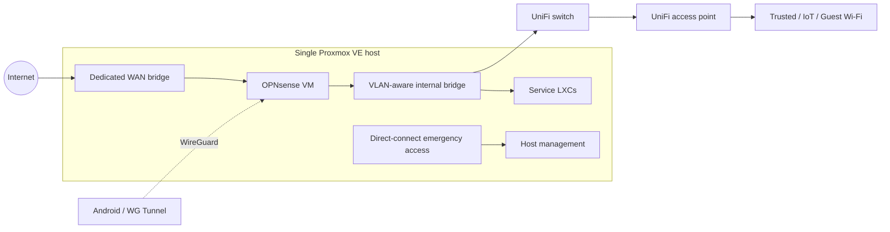
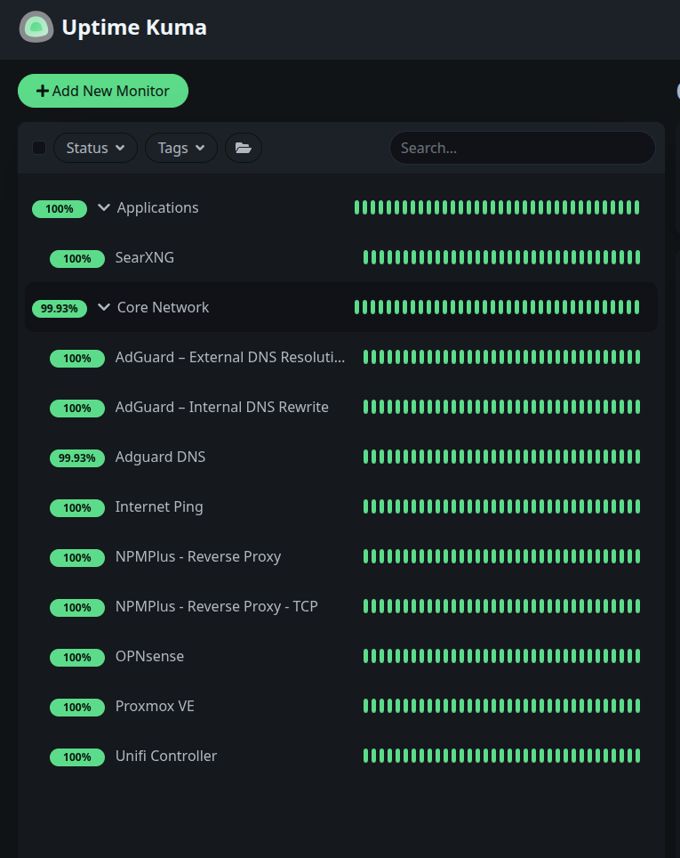

# Home Infrastructure Lab

**Proxmox VE · OPNsense · UniFi · Linux · Self-hosted services**

A personally maintained infrastructure lab combining virtualized compute, segmented networking, internal HTTPS, remote access, and documented recovery procedures.

Maintained by [tob9292](https://github.com/tob9292).

## Project at a glance

| Area | Implementation |
| --- | --- |
| Compute | One Proxmox VE host; one firewall VM and nine LXC containers |
| Networking | Five VLANs separating Management, Trusted, IoT, Guest/Work, and Servers |
| Routing and remote access | OPNsense stateful firewall, DHCP, and WireGuard |
| Switching and wireless | UniFi-managed switching and VLAN-mapped Wi-Fi networks |
| Internal services | DNS filtering, reverse proxy, monitoring, search, calendars, messaging, and automation |
| Administration | Named accounts, TOTP MFA on key management interfaces, and SSH public-key authentication |
| Recovery | Scheduled workload and host-configuration backups, offline/off-site copies, and emergency access procedures |
| Documentation | A private Obsidian knowledge base, with selected material rewritten for this public portfolio |

## Physical hardware

| Component | Hardware |
| --- | --- |
| Proxmox host | TekLager TLSense 10810U; Intel Core i7-10810U; 32 GB DDR4 SO-DIMM RAM |
| Workload storage | Samsung PM9A1 1 TB NVMe SSD |
| Local backup storage | Samsung 870 EVO 500 GB SATA SSD |
| Switch | UniFi Flex 2.5G (`USW-Flex-2.5G-8`), with eight 2.5 GbE ports and a 10 GbE combination uplink |
| Access point | UniFi U7 Pro Wall, powered by a separate PoE injector |

See the [hardware details and host installation photo](docs/architecture.md#physical-hardware) and [UniFi hardware and AP installation photo](docs/network-and-security.md#network-hardware).

## Architecture

OPNsense and the application containers run on the Proxmox VE host, connected through dedicated WAN and internal network bridges.

## Lab in operation

Proxmox brings the firewall VM, application containers, storage, and host resources into one management view. The [architecture page](docs/architecture.md) explains each workload's role.

View the infrastructure monitoring dashboard

The [monitoring page](docs/monitoring.md) covers DNS resolution, reverse-proxy connectivity, management endpoints, and application checks.

## Explore the project

- [Architecture and workload inventory](docs/architecture.md)
- [Network segmentation and administrative security](docs/network-and-security.md)
- [DNS and internal HTTPS](docs/dns-and-https.md)
- [Service and infrastructure monitoring](docs/monitoring.md)
- [Backup and recovery design](docs/backup-and-recovery.md)
- [Android VPN automation](docs/android-vpn.md)
- [Automation and documentation workflow](docs/automation-and-documentation.md)
- [Firewall change procedure](docs/runbooks/firewall-change.md)
- [DNS troubleshooting procedure](docs/runbooks/dns-troubleshooting.md)

## Project goals

This project demonstrates practical work with VLANs and inter-network policy, Linux virtualization, service dependencies, authentication, backup scheduling, and maintainable operational documentation.

The documentation covers the network layout, service configuration, administration workflows, and recovery procedures.

## Public documentation conventions

Addresses in `10.77.0.0/16`, domains under `example.com`, and generic account names are illustrative replacements. They preserve the relationships between components while keeping live endpoint details private.

Configuration exports, credentials, MFA recovery material, private keys, original screenshots, and vault history remain private.

Screenshots show the actual services, with live addresses, registered domains, device identifiers, and private browsing information removed. The captures are from October 2026.

Hardware photos show the installed equipment. Public copies have location and other image metadata removed; the original photographs remain private.
