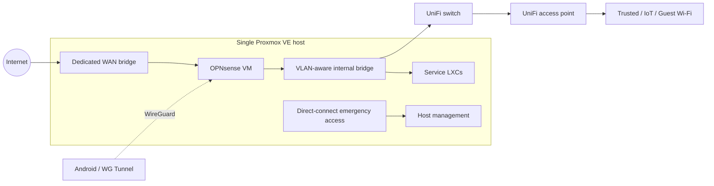

# Home Infrastructure Lab

**Proxmox VE · OPNsense · UniFi · Linux · Self-hosted services**

A personally maintained infrastructure lab combining virtualized compute, segmented networking, internal HTTPS, remote access, and documented recovery procedures.

Maintained by [tob9292](https://github.com/tob9292).

## Project at a glance

| Area | Implementation |
| --- | --- |
| Compute | One Proxmox VE host; one firewall VM and nine LXC containers |
| Networking | Five VLANs separating Management, Trusted, IoT, Guest/Work, and Servers |
| Routing and remote access | OPNsense stateful firewall, DHCP, and WireGuard |
| Switching and wireless | UniFi-managed switching and VLAN-mapped Wi-Fi networks |
| Internal services | DNS filtering, reverse proxy, monitoring, search, calendars, messaging, and automation |
| Administration | Named accounts, TOTP MFA on key management interfaces, and SSH public-key authentication |
| Recovery | Scheduled workload and host-configuration backups, offline/off-site copies, and emergency access procedures |
| Documentation | A private Obsidian knowledge base, with selected material rewritten for this public portfolio |

## Architecture



OPNsense and the application containers run on the Proxmox VE host, connected through dedicated WAN and internal network bridges.

## Explore the project

- [Architecture and workload inventory](docs/architecture.md)
- [Network segmentation and administrative security](docs/network-and-security.md)
- [DNS and internal HTTPS](docs/dns-and-https.md)
- [Backup and recovery design](docs/backup-and-recovery.md)
- [Android VPN automation](docs/android-vpn.md)
- [Automation and documentation workflow](docs/automation-and-documentation.md)
- [Firewall change procedure](docs/runbooks/firewall-change.md)
- [DNS troubleshooting procedure](docs/runbooks/dns-troubleshooting.md)
- [Publication policy and local checks](docs/publication-policy.md)

## Engineering focus

This project demonstrates practical work with VLANs and inter-network policy, Linux virtualization, service dependencies, authentication, backup scheduling, and maintainable operational documentation.

The documentation covers the network layout, service configuration, administration workflows, and recovery procedures.

## Public documentation conventions

Addresses in `10.77.0.0/16`, domains under `example.com`, and generic account names are illustrative replacements. They preserve the relationships between components while keeping live endpoint details private.

Configuration exports, credentials, MFA recovery material, private keys, original screenshots, and vault history remain private.

## Check this repository

Python 3 and [Gitleaks](https://github.com/gitleaks/gitleaks) are required for the complete local check:

```sh
python3 scripts/check_public_content.py
python3 -B -m unittest discover -s tests -v
gitleaks dir --redact --no-banner .
```

Before committing, run the automated checks and review the staged files as described in the [publication policy](docs/publication-policy.md).
