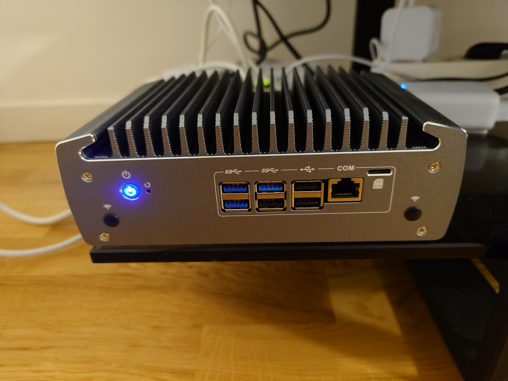
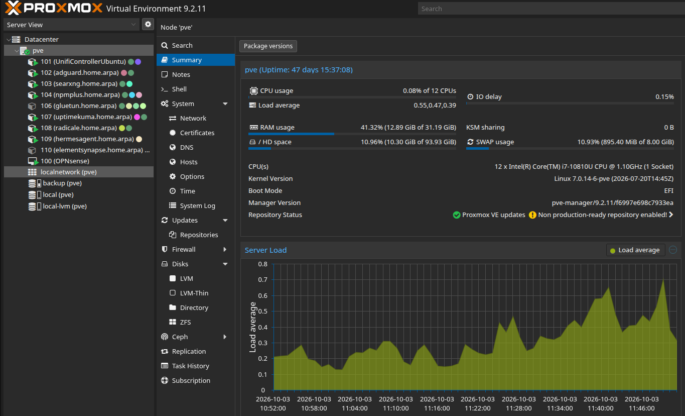

# Architecture and workload inventory

## Physical and virtual layout

The lab runs on a TekLager TLSense 10810U with 32 GB of RAM, NVMe-backed workload storage, and a separate SATA backup SSD. OPNsense is a VM; application services run in LXC containers.

### Physical hardware

The [TLSense 10810U](https://teklager.se/en/products/routers/tlsense-10810U) is a compact, passively cooled system with six 2.5 GbE Ethernet ports.

| Component | Installed hardware | Role |
| --- | --- | --- |
| Processor | Intel Core i7-10810U, 6 cores / 12 threads | Proxmox VE, the firewall VM, and service containers |
| Memory | 32 GB, 2 x 16 GB DDR4 SO-DIMM modules rated DDR4-3200 | Host and workload memory |
| NVMe SSD | Samsung PM9A1 1 TB, M.2 2280, PCIe 4.0 x4 capable | Proxmox system disk, LVM, and LVM-thin workload storage |
| SATA SSD | Samsung 870 EVO 500 GB, 2.5-inch SATA | Dedicated local workload and host-configuration backups |

The photo shows the installed host, its passive-cooling fins, front USB ports, serial console connector, and power indicator.

Product documentation: [Intel i7-10810U specifications](https://www.intel.com/content/www/us/en/products/sku/201888/intel-core-i710810u-processor-12m-cache-up-to-4-90-ghz/specifications.html), [Samsung PM9A1 overview](https://download.semiconductor.samsung.com/resources/brochure/Product%20Overviews%20PM9A1%20SSD%20Storage%20for%20the%20Next-Generation%20PC.pdf), and [Samsung 870 EVO data sheet](https://image.semiconductor.samsung.com/resources/data-sheet/Samsung_SSD_870_EVO_Data_Sheet_Rev1.1.pdf).

### Proxmox layout

The node summary displays CPU, RAM, disk, and load information alongside the workload tree. The host uses an Intel Core i7-10810U with twelve logical CPUs. OPNsense has its own virtual CPU and memory allocation; the application containers have individual resource settings.

The host network separates three paths:

| Path | Purpose |
| --- | --- |
| Dedicated WAN bridge | Connects the external uplink to the OPNsense VM |
| VLAN-aware internal bridge | Carries the internal networks between OPNsense, workloads, and the UniFi switch |
| Dedicated emergency bridge | Provides direct-connect host management when routed access is unavailable |

Normal Proxmox administration uses the Management VLAN. The emergency interface has no default gateway and provides direct-connect access for recovery.

## Logical networks

All addresses below are illustrative.

| VLAN | Role | Example subnet |
| --- | --- | --- |
| 10 | Management | `10.77.10.0/24` |
| 20 | Trusted | `10.77.20.0/24` |
| 30 | IoT | `10.77.30.0/24` |
| 40 | Guest/Work | `10.77.40.0/24` |
| 50 | Servers | `10.77.50.0/24` |
| — | WireGuard tunnel | `10.77.60.0/24` |

UniFi networks use OPNsense as their third-party gateway. Wi-Fi networks map Trusted, Home-IoT, and Guest/Work clients to their corresponding VLANs. IoT Wi-Fi uses 2.4 GHz; Trusted and Guest/Work use 2.4, 5, and 6 GHz. The [networking page](network-and-security.md#unifi-switching-and-wireless) contains the Wi-Fi and switch-port configuration.

## Workload inventory

The lab contains ten configured workloads:

| Type | Workload | Placement | Role |
| --- | --- | --- | --- |
| VM | OPNsense | WAN and internal trunk | Routing, firewall, DHCP, upstream DNS, remote access |
| LXC | UniFi Network | Management | Switching and wireless configuration |
| LXC | AdGuard Home | Servers | Client DNS filtering and local service-name rewrites |
| LXC | SearXNG | Servers | Self-hosted search |
| LXC | NPMplus | Servers | Internal HTTPS reverse proxy |
| LXC | Gluetun | Servers | Separate VPN/proxy service |
| LXC | Uptime Kuma | Servers | Service and infrastructure monitoring |
| LXC | Radicale | Servers | CalDAV and CardDAV |
| LXC | Hermes Agent | Servers | Infrastructure and documentation automation |
| LXC | Matrix/Synapse | Servers | Messaging, with an administration interface |

Workloads are configured to start with the host. New workloads must also be added to the backup job's explicit inclusion list.

## Service integration

- OPNsense connects the internal networks and provides remote access through WireGuard.
- AdGuard Home resolves client DNS queries, while NPMplus provides HTTPS access to internal applications.
- Uptime Kuma monitors DNS, reverse-proxy connectivity, services, and infrastructure management endpoints; see [monitoring](monitoring.md).
- The direct-connect management path provides access to Proxmox during recovery.
- Scheduled archives and offline/off-site copies provide workload and host rebuild information.

See [network security](network-and-security.md), [DNS and HTTPS](dns-and-https.md), and [backup design](backup-and-recovery.md).
