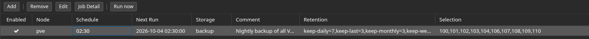
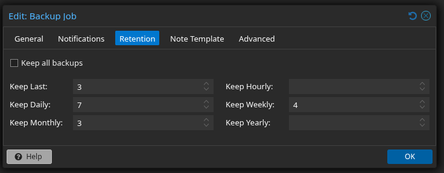

# Backup and recovery design

## Backup layers

| Layer | Purpose | Schedule or handling |
| --- | --- | --- |
| Proxmox VM/LXC archives | Recover workload configuration and disks | Nightly snapshot-mode backups with Zstandard compression |
| Proxmox host-configuration archive | Rebuild host networking, storage references, and supporting configuration | Daily systemd timer; 30-day retention |
| Offline/off-site USB copy | Retain workload and host backups outside the active host | Manual copy and disconnect procedure |
| OPNsense configuration export | Restore firewall settings independently of a full guest restore | Retained before relevant changes |
| OPNsense ZFS boot environment | Revert the firewall's system state | Created before selected changes and updates |

Scheduled archives are stored on the dedicated Samsung 870 EVO 500 GB SATA SSD. Proxmox and workload disks use the Samsung PM9A1 1 TB NVMe SSD, and a USB disk holds the offline/off-site copy. See the [installed hardware](architecture.md#physical-hardware) for drive details.

## Workload selection and retention

The nightly job explicitly selects all ten documented workloads. Deploying a new VM or container requires updating this list.

The workload backup runs at 02:30 and writes to the dedicated `backup` storage. The selection includes the OPNsense VM and all nine application containers.

| Retention setting | Value |
| --- | ---: |
| Keep last | 3 |
| Daily | 7 |
| Weekly | 4 |
| Monthly | 3 |

The retention settings keep recent archives alongside daily, weekly, and monthly recovery points.

## Host rebuild information

The daily host archive covers Proxmox configuration and its cluster database, networking, storage mounts, boot settings, package information, SSH configuration, custom inventory tooling, and systemd units. Supporting metadata records version, network, and storage state with SHA-256 checksums.

The backup script checks that the backup destination is mounted before writing. Temporary archive creation and restrictive file permissions help prevent incomplete archives and unnecessary local exposure.

Host-configuration archives remain private because they contain authentication material and other secrets.

## Recovery sequence

1. Establish physical access and the direct-connect Proxmox management path if routing is unavailable.
2. Assess host and storage health without overwriting recoverable disks.
3. Rebuild the host only if necessary, using the recorded network and storage layout.
4. Restore OPNsense and validate management access and routing.
5. Restore DNS and reverse-proxy services, followed by dependent applications.
6. Test application access and backup scheduling before returning to normal operation.

A ZFS boot environment provides local system rollback. Activating an older environment returns the firewall to that environment's configuration and authentication state. VM/LXC backup archives and the offline/off-site copy provide separate recovery paths.

