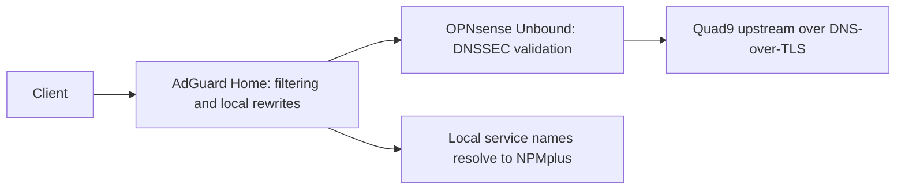

# DNS and internal HTTPS

## Resolution path

Dnsmasq supplies DHCP on OPNsense; its DNS listener is disabled. AdGuard Home provides client-facing filtering and local service-name rewrites. Unbound supplies upstream resolution with DNSSEC and DNS-over-TLS to Quad9.

Trusted, IoT, and Guest/Work DHCP options advertise AdGuard as DNS. The WireGuard peer generator also supplies AdGuard as client DNS.

DNS troubleshooting follows the query path through the client, AdGuard, Unbound, and the upstream resolver.

## Namespaces

Local device names use `home.arpa`. Internal HTTPS services use a subdomain of a personally controlled registered domain; this public documentation substitutes `home.example.com`.

An AdGuard wildcard rewrite directs internal service names to NPMplus. The illustrative reverse-proxy address is `10.77.50.12`.

| Illustrative service name | Backend function |
| --- | --- |
| `dns.home.example.com` | AdGuard administration |
| `search.home.example.com` | SearXNG |
| `status.home.example.com` | Uptime Kuma |
| `calendar.home.example.com` | Radicale |
| `automation.home.example.com` | Hermes |
| `matrix.home.example.com` | Synapse |
| `matrix-admin.home.example.com` | Synapse administration |

## Certificates and proxying

NPMplus terminates HTTPS with a wildcard certificate obtained through Certbot. DNS-01 validation verifies domain ownership through the DNS provider's API.

DNS-provider credentials are privileged secrets. They remain outside this repository, alongside private keys, exported proxy configuration, and account recovery codes.

The reverse proxy's `Internal Networks` list restricts client addresses. Each application remains responsible for its own authentication and authorization.

See [network security](network-and-security.md) and the [DNS troubleshooting procedure](runbooks/dns-troubleshooting.md).
