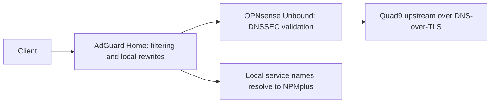
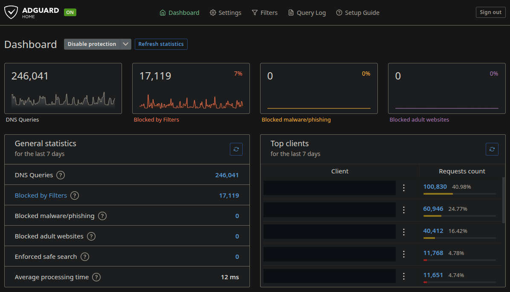
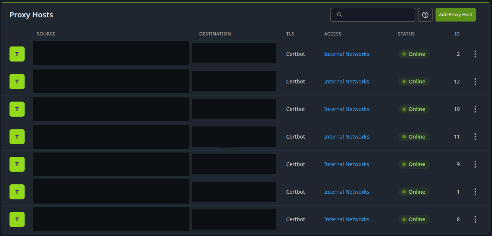
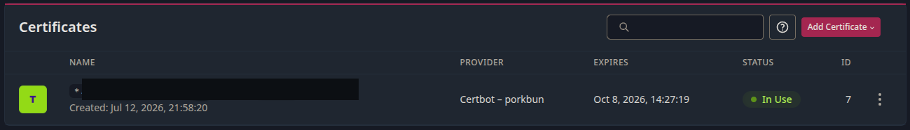

# DNS and internal HTTPS

## Resolution path

Dnsmasq supplies DHCP on OPNsense; its DNS listener is disabled. AdGuard Home provides client-facing filtering and local service-name rewrites. Unbound supplies upstream resolution with DNSSEC and DNS-over-TLS to Quad9.

Trusted, IoT, and Guest/Work DHCP options advertise AdGuard as DNS. The WireGuard peer generator also supplies AdGuard as client DNS.

DNS troubleshooting follows the query path through the client, AdGuard, Unbound, and the upstream resolver.

## AdGuard Home dashboard

AdGuard Home is the client-facing DNS service. Its dashboard summarizes query volume, filtered requests, average processing time, and activity by client.

Client identities are masked, and the queried-domain lists are omitted from the public screenshot.

## Namespaces

Local device names use `home.arpa`. Internal HTTPS services use a subdomain of a personally controlled registered domain; this public documentation substitutes `home.example.com`.

An AdGuard wildcard rewrite directs internal service names to NPMplus. The illustrative reverse-proxy address is `10.77.50.12`.

| Illustrative service name | Backend function | Backend TCP port |
| --- | --- | ---: |
| `dns.home.example.com` | AdGuard administration | 80 |
| `search.home.example.com` | SearXNG | 8888 |
| `status.home.example.com` | Uptime Kuma | 3001 |
| `calendar.home.example.com` | Radicale | 5232 |
| `automation.home.example.com` | Hermes | 9119 |
| `matrix.home.example.com` | Synapse | 8008 |
| `matrix-admin.home.example.com` | Synapse administration | 5173 |

## NPMplus proxy hosts

NPMplus maps each service name to its HTTP backend. Clients connect over HTTPS, and the proxy forwards requests to the application's internal address and port.

All seven proxy hosts use the `Internal Networks` access list. The source and destination fields are masked in the screenshot; the table above gives their roles using illustrative names.

## Certificates and proxying

NPMplus terminates HTTPS with a shared wildcard certificate obtained through Certbot using the Porkbun DNS provider. DNS-01 validation verifies domain ownership through the provider's API, without requiring an inbound HTTP validation port forward.

The certificate view lists the provider, expiration date, and whether the certificate is in use. During certificate maintenance, check renewal results, certificate expiry, and HTTPS access to the proxy hosts.

DNS-provider credentials are privileged secrets. They remain outside this repository, alongside private keys, exported proxy configuration, and account recovery codes.

The reverse proxy's `Internal Networks` list restricts client addresses. Each application remains responsible for its own authentication and authorization.

See [network security](network-and-security.md), [DNS and proxy monitoring](monitoring.md), and the [DNS troubleshooting procedure](runbooks/dns-troubleshooting.md).
