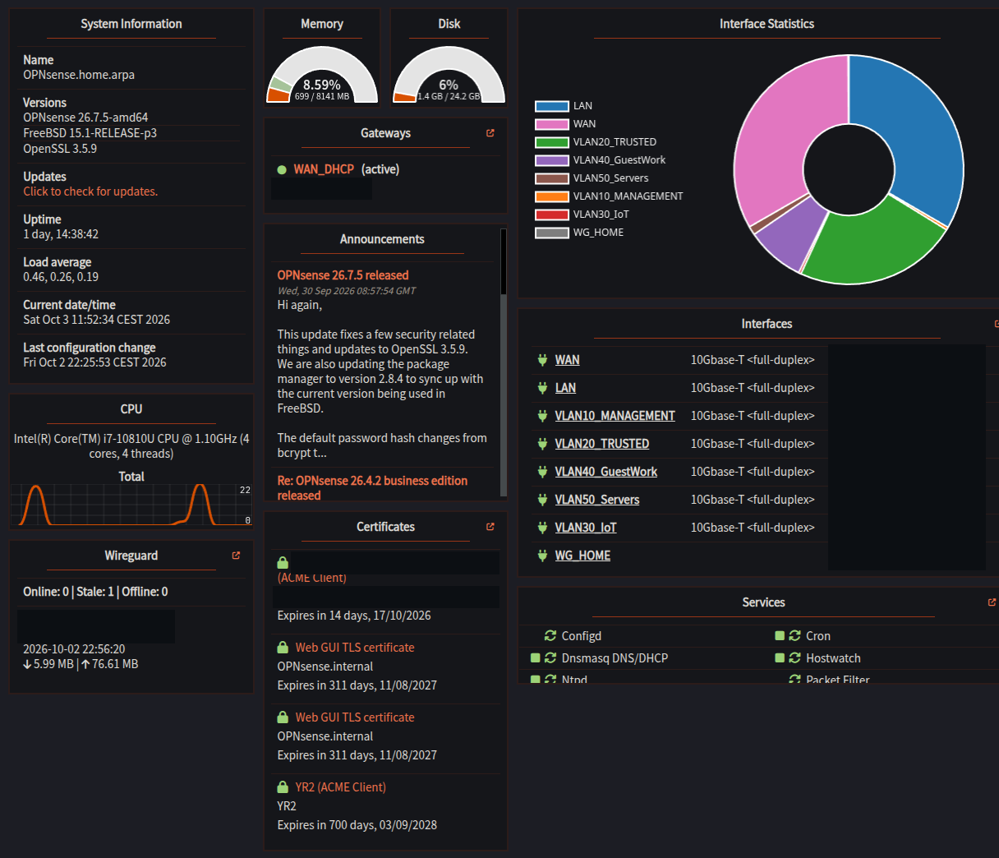
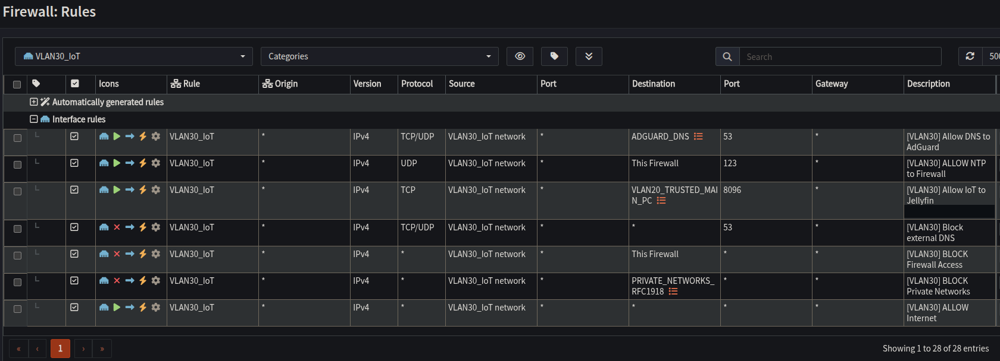
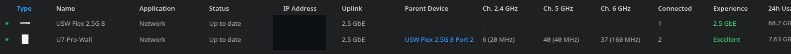
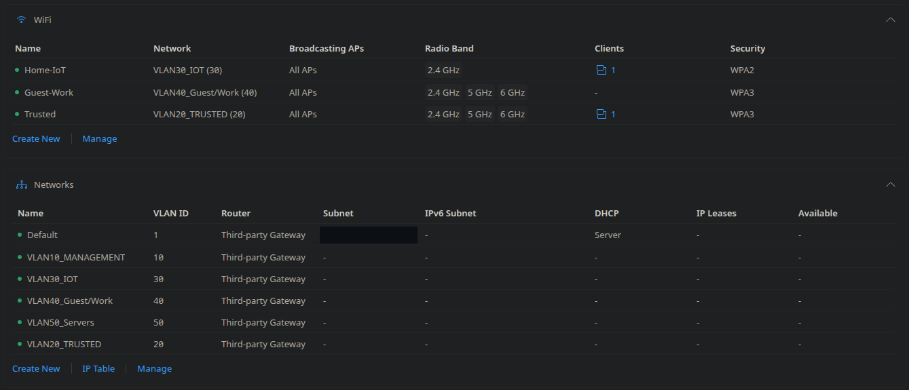
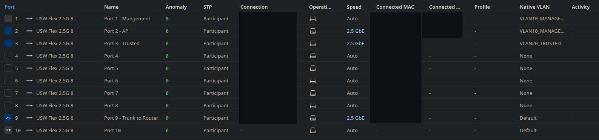
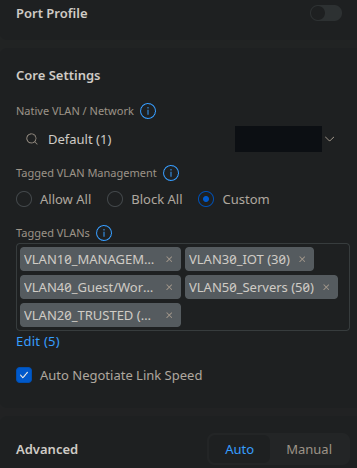

# Network segmentation and administrative security

## OPNsense platform

The OPNsense VM is the gateway for the internal VLANs and the WireGuard client network. It handles routing, firewall policy, DHCP, NTP, and the upstream DNS resolver used by AdGuard Home.

The dashboard brings gateway status, interface activity, system resources, and running services into one view. The interface names identify Management, Trusted, IoT, Guest/Work, Servers, and the home WireGuard tunnel.

## Routing policy

OPNsense routes between five internal VLANs. Internal addressing and policy are IPv4-only. The WAN uses DHCP, with IPv6 disabled. The unnumbered internal parent interface has its legacy default allow rules disabled.

The general interface-rule structure is:

1. Permit required internal services.
2. Block other restricted private-network destinations.
3. Permit remaining outbound internet traffic.

Key inter-network access rules:

| Source | Selected permitted internal access |
| --- | --- |
| Management | Firewall administration, infrastructure DNS/NTP, and NPMplus administration |
| Trusted clients | AdGuard DNS and internal HTTPS through NPMplus |
| Designated Trusted administrator workstation | Server-VLAN SSH, NPMplus administration, and broader access to selected management systems |
| IoT | AdGuard DNS and firewall NTP |
| Guest/Work | AdGuard DNS and firewall NTP |
| Servers | Required infrastructure services, with selected cross-VLAN automation and monitoring exceptions |
| WireGuard clients | AdGuard DNS and internal proxy HTTPS; other private destinations are restricted |

Hermes has selected access to the administration workstation for documentation integration and to the Proxmox API. Uptime Kuma has selected access to infrastructure management endpoints for monitoring.

## IoT interface rules

The IoT DNS, time synchronization, and network restrictions are:

| Action | Destination and purpose |
| --- | --- |
| Allow TCP/UDP 53 | AdGuard Home for DNS resolution |
| Allow UDP 123 | The firewall for time synchronization |
| Block TCP/UDP 53 | Other DNS destinations |
| Block | Other access to the firewall itself |
| Block | Other destinations in the private-network alias |
| Allow | Remaining outbound internet traffic |

The DNS and NTP allowances precede the broader blocks. The final internet rule follows the private-network restrictions.

## UniFi switching and wireless

The UniFi Network controller runs in a Management-VLAN LXC. It manages a USW Flex 2.5G 8 switch and a U7-Pro-Wall access point. OPNsense remains responsible for routing, DHCP, and inter-VLAN firewall policy.

The access point connects to switch port 2 with a 2.5 GbE uplink. Wireless networks assign clients to the corresponding VLAN:

| Wi-Fi network | VLAN | Bands | Security |
| --- | ---: | --- | --- |
| Trusted | 20 | 2.4, 5, and 6 GHz | WPA3 |
| Home-IoT | 30 | 2.4 GHz | WPA2 |
| Guest-Work | 40 | 2.4, 5, and 6 GHz | WPA3 |

### Switch ports

Named switch ports identify the main wired connections:

| Port | Role | Native VLAN shown in UniFi |
| --- | --- | --- |
| 1 | Management connection | Management, VLAN 10 |
| 2 | Access point | Management, VLAN 10 |
| 3 | Trusted workstation connection | Trusted, VLAN 20 |
| 9 | Trunk to the router | Default, VLAN 1 |

Port names make the physical connections easy to identify during maintenance. The AP uplink, Trusted connection, and router trunk are displayed at 2.5 GbE.

### Router trunk — port 9

The router uplink uses individual port settings with an explicit tagged-VLAN list:

| Setting | Configuration |
| --- | --- |
| Native VLAN / Network | Default, VLAN 1 |
| Tagged VLAN Management | Custom |
| Tagged VLANs | 10 — Management; 20 — Trusted; 30 — IoT; 40 — Guest/Work; 50 — Servers |
| Auto Negotiate Link Speed | Enabled |
| Advanced mode | Auto |

Management, Trusted, IoT, Guest/Work, and Servers traffic crosses the trunk with its VLAN tags. Untagged traffic uses the native Default network. Selecting `Custom` limits tagged traffic to the five listed VLANs instead of allowing every tagged VLAN.

## Management-plane controls

| Platform | Routine identity and authentication | Additional control |
| --- | --- | --- |
| OPNsense | Named administrator; password-first TOTP | Built-in root account disabled; WebGUI bound to Management and Trusted |
| Proxmox VE | Named PAM account with TOTP for the WebGUI; SSH public keys for shell access | Management VLAN and separate direct-connect recovery path |
| NPMplus | Named administrator with two-factor authentication | Built-in Administrator account disabled; routed access to the administration port restricted |

NPMplus account settings manage application administrators. Proxmox shell administration uses a named account with SSH public-key authentication and passwordless sudo. Keep administrative SSH keys securely stored.

## Reverse-proxy access list

The `Internal Networks` list applies to seven internal proxy hosts. It permits Management, Trusted, Servers, and WireGuard client networks, followed by denial of other source addresses. IoT and Guest/Work are not included.

`Satisfy Any` and `Pass Auth to Upstream` are disabled. The list controls access to the proxy hosts by source address. OPNsense separately restricts routed access to the NPMplus administration panel.

NPMplus HTTP and HTTPS services are available internally, with no WAN port forwards for either service.

## Traffic paths and access controls

Inter-VLAN traffic passes through OPNsense. Devices in the same subnet communicate through the switch or virtual bridge. Access controls for these local connections belong at the application or workload level.

Keep account recovery material and backup archives private, and use the documented console or direct-connect procedures for recovery access.

For controlled changes, use the [firewall change procedure](runbooks/firewall-change.md).
